# Лабораторная работа №1

### №1 - Вывод прграммы: имя и возраст через год
```
name = (input('Имя: '))
age = int(input('Возраст: '))
print('Привет, ', name, '! Через год тебе будет ', age+1, '.', sep='')
```

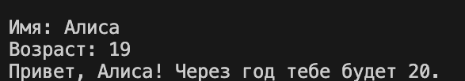
### №2 - Вывод прграммы: сумма и среднее число
```
a = float(input('a: ').replace(',', '.'))
b = float(input('b: ').replace(',', '.'))
sum = round(a+b, 2)
avg = round(sum/2, 2)
print('sum=',sum,'; avg=', avg, sep = '')
```

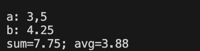
### №3 - Вывод прграммы: база после скидки, НДС, итог к оплате
```
price = float(input('Цена(₽): ').replace(',','.'))
discount = float(input('Скидка(%): ').replace(',','.'))
vat = float(input('НДС(%): ').replace(',','.'))
base = price * (1 - discount/100)
vat_amount = base * (vat/100)
total = base + vat_amount
print(f'База после скидки: {base:.2f} ₽')
print(f'НДС: {vat_amount:.2f} ₽')
print(f'Итого к оплате: {total:.2f} ₽')
```

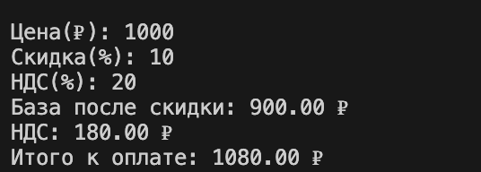
### №4 - Вывод прграммы: время
```
m = int(input('Минуты:'))
hours = m // 60
minutes = m % 60
print(f"{hours}:{minutes:02d}")
```

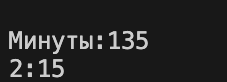
### №5 -  Вывод прграммы: инициалы и цена
```
name = input('ФИО:').strip()
parts = name.split()
initials = ''.join(part[0].upper() for part in parts) + '.'
length =len(' '.join(parts))
print('Инициалы:', initials)
print('Длина (символов):', length)
```

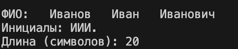

# Лабораторная работа №2
### №1 Работа со списками
```
def min_max(nums: list[float | int]) -> tuple[float | int, float | int]:
    if not nums:
        raise ValueError("Список пуст")
    min_n = nums[0]
    max_n = nums[0]
    for num in nums:
        if num < min_n:
            min_n = num
        if num > max_n:
            max_n = num
    return (min_n, max_n)

def unique_sorted(nums: list[float | int]) -> list[float | int]:
    return sorted(set(nums))


def flatten(mat: list[list | tuple]) -> list:
    result = []
    for item in mat:
        if not isinstance(item, (list, tuple)):
            raise TypeError("Строка не строка строк матрицы")
        
        result.extend(item)
    
    return result


print(min_max([3, -1, 5, 5, 0]))
print(min_max([42]))
print(min_max([-5, -2, -9]))
#print(min_max([ ]))
print(min_max([1.5, 2, 2.0, -3.1]))

print(unique_sorted([3, 1, 2, 1, 3]))
print(unique_sorted([]))
print(unique_sorted([-1, -1, 0, 2, 2]))
print(unique_sorted([1.0, 1, 2.5, 2.5, 0]))

print(flatten([[1, 2], [3, 4]]))
print(flatten(([1, 2], (3, 4, 5))))
print(flatten([[1], [], [2, 3]]))
#print(flatten([[1, 2], 'ab']))

```
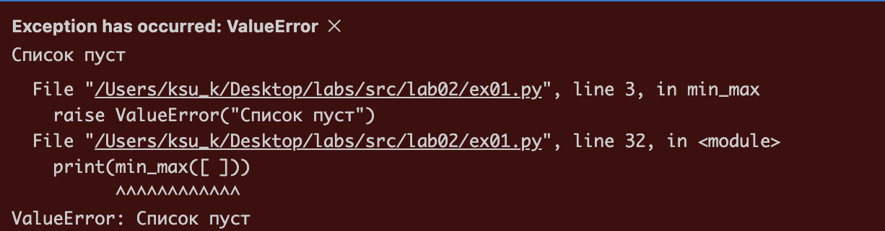
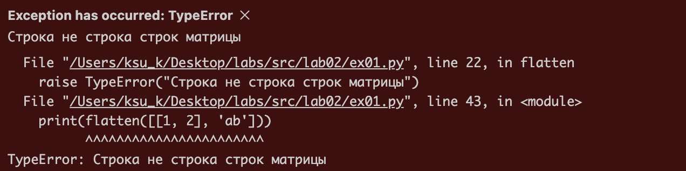
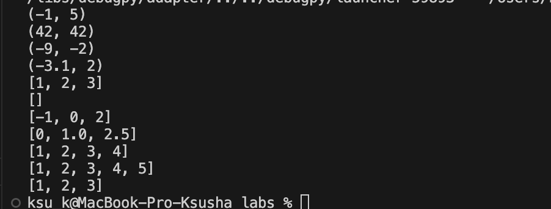
### №2 Функции (для прямоугольных матриц)
```
def check_rec(mat: list[list]) -> tuple[int, int]:
    if not mat:
        return 0, 0
    
    rows = len(mat)
    cols = len(mat[0])
    
    for i in range(rows):
        if len(mat[i]) != cols:
            raise ValueError("Матрица должна быть прямоугольной")
    
    return rows, cols

def transpose(mat: list[list[float | int]]) -> list[list]:
    rows, cols = check_rec(mat)
    if rows == 0:
        return []
    
    result = []
    for j in range(cols):
        new_row = []
        for i in range(rows):
            new_row.append(mat[i][j])
        result.append(new_row)
    
    return result

def row_sums(mat: list[list[float | int]]) -> list[float]:
    rows, cols = check_rec(mat)
    
    if rows == 0:
        return []
    
    sums = []
    for i in range(rows):
        row_sum = 0
        for j in range(cols):
            row_sum += mat[i][j]
        sums.append(row_sum)
    
    return sums

def col_sums(mat: list[list[float | int]]) -> list[float]:

    rows, cols = check_rec(mat)
    
    if cols == 0:
        return []
    
    sums = []
    for j in range(cols):
        col_sum = 0
        for i in range(rows):
            col_sum += mat[i][j]
        sums.append(col_sum)
    
    return sums

print(transpose([[1, 2, 3]]))
print(transpose([[1], [2], [3]]))
print(transpose([[1, 2], [3, 4]]))
print(transpose([ ]))
#print(transpose([[1, 2], [3]]))

print(row_sums([[1, 2, 3], [4, 5, 6]]))
print(row_sums([[-1, 1], [10, -10]]))
print(row_sums([[0, 0], [0, 0]]))
#print(row_sums([[1, 2], [3]]))

print(col_sums([[1, 2, 3], [4, 5, 6]]))
print(col_sums([[-1, 1], [10, -10]]))
print(col_sums([[0, 0], [0, 0]]))
#print(col_sums([[1, 2], [3]]))

```
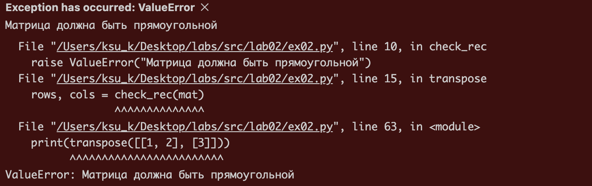
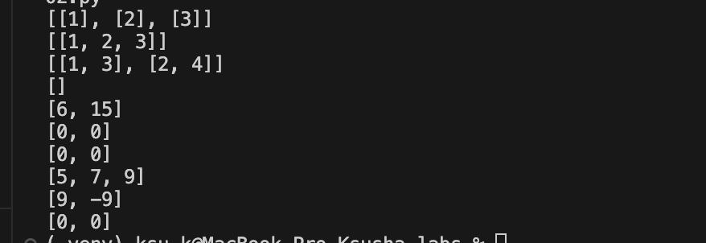

### №3 Форматирование записей
```
def format_record(rec: tuple[str, str, float]) -> str:
    
    if not isinstance(rec, tuple):
        raise TypeError("Входные данные должны быть кортежем")
    
    if len(rec) != 3:
        raise ValueError("Кортеж должен содержать 3 элемента: (ФИО, группа, GPA)")
    
    fio, group, gpa = rec
    
    if not isinstance(fio, str):
        raise TypeError("ФИО должно быть строкой")
    
    if not isinstance(group, str):
        raise TypeError("Название группы должно быть строкой")
    
    if not isinstance(gpa, (int, float)):
        raise TypeError("GPA должно быть числом")
    
    if not fio.strip():
        raise ValueError("ФИО не может быть пустым")
    
    if not group.strip():
        raise ValueError("Название группы не может быть пустым")
    
    if gpa < 0 or gpa > 5.0:  
        raise ValueError("GPA должно быть в диапазоне от 0 до 5.0")
    

    fio_parts = [part.strip() for part in fio.split() if part.strip()]
    

    if len(fio_parts) < 2:
        raise ValueError("ФИО должно содержать фамилию и хотя бы одно имя")
    

    capital_parts = []
    for part in fio_parts:
        if not part:  
            raise ValueError("Части ФИО не могут быть пустыми")
        capital_parts.append(part[0].upper() + part[1:].lower())
    

    initials = []
    for name in capital_parts[1:]:  
        if len(name) < 1:
            raise ValueError("Имена не могут быть пустыми")
        initials.append(f"{name[0].upper()}.")
    

    formatted_fio = f"{capital_parts[0]} {' '.join(initials)}"
    

    formatted_gpa = f"{gpa:.2f}"
    

    return f"{formatted_fio}, гр. {group}, GPA {formatted_gpa}"


print(format_record(("Иванов Иван Иванович", "BIVT-25", 4.6)))
print(format_record(("  сидорова  анна   сергеевна ", "ABB-01", 3.999)))
print(format_record(["Петров Пётр", "IKBO-12", 5.0]))
print(format_record(["Петров Пётр Петрович", "IKBO-12", 5.0]))

```
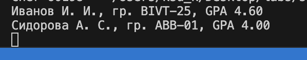
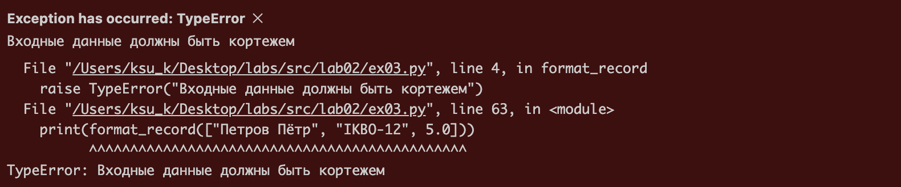

# Лабораторная работа №3
### №1 - text.py
###### Нормализация текста, разбиение на слова, подсчитывание частоты и распределение по алфавиту и убыванию частоты


```
import re


def normalize(text: str, *, casefold: bool = True, yo2e: bool = True) -> str:
    """Нормализует текст: приводит регистр, заменяет ё на е, убирает лишние пробелы."""
    if not isinstance(text, str):
        raise TypeError("Текст должен быть строкой")
    
    if not text:
        return ""
    
    
    if yo2e:
        text = text.replace('ё', 'е').replace('Ё', 'Е')
    
    
    if casefold:
        text = text.casefold()
    
    
    text = re.sub(r'[\t\r\n]+', ' ', text)
    
    
    text = re.sub(r'\s+', ' ', text)
    
    return text.strip()


def tokenize(text: str) -> list[str]:
    """Разбивает текст на токены (слова)."""
    if not isinstance(text, str):
        raise TypeError("Текст должен быть строкой")
    
    if not text:
        return []
    
    
    pattern = r'\b\w+(?:-\w+)*\b'
    tokens = re.findall(pattern, text)
    
    return tokens


def count_freq(tokens: list[str]) -> dict[str, int]:
    """Подсчитывает частоту встречаемости токенов."""
    if not isinstance(tokens, list):
        raise TypeError("Токены должны быть списком")
    
    freq_dict = {}
    for token in tokens:
        freq_dict[token] = freq_dict.get(token, 0) + 1
    
    return freq_dict


def top_n(freq: dict[str, int], n: int = 5) -> list[tuple[str, int]]:
    """Возвращает топ-N самых частых слов."""
    if not isinstance(freq, dict):
        raise TypeError("Частоты должны быть словарем")
    if not isinstance(n, int) or n < 0:
        raise ValueError("n должно быть неотрицательным целым числом")
    
    if not freq:
        return []
    
    
    items = list(freq.items())
    
    # Сортировка по убыванию частоты, при равенстве - по алфавиту
    items.sort(key=lambda x: (-x[1], x[0]))
    
    return items[:n]

if __name__ == "__main__":

    print(normalize('ПрИвЕт\nМИр\t'))
    print(normalize('ёжик, Ёлка'))
    print(normalize('Hello\r\nWorld'))
    print(normalize('  двойные   пробелы  '))

    print(tokenize('привет мир'))
    print(tokenize('hello,world!!!'))
    print(tokenize('по-настоящему круто'))
    print(tokenize('2025 год'))
    print(tokenize('emoji 😀 не слово'))

    tokence1 = count_freq(["a", "b", "a", "c", "b", "a"])
    print(tokence1)
    print(top_n(tokence1, 2))

    tokence2 = count_freq(["bb","aa","bb","aa","cc"])
    print(tokence2)
    print(top_n(tokence2, 2))


```
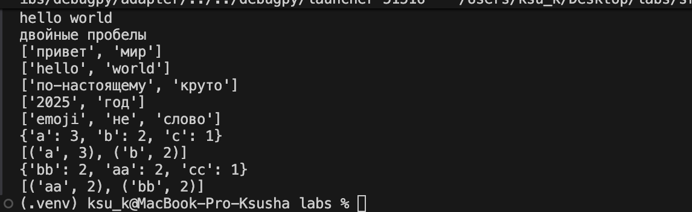

### №2 - text_stats.py

###### Находит кол-во слов и кол-во уникальных слов, а также топ-5 слов. Ввод происходит через терминал таким способом: echo "Привет, мир! Привет!!!" | python3 src/lab03/text_stats.py

```

import sys

# Импортируем наши функции из той же папки
try:
    from lib.text import normalize, tokenize, count_freq, top_n
except ImportError:
    # Альтернативный импорт для тестирования
    import os
    import sys
    sys.path.append(os.path.dirname(os.path.dirname(__file__)))
    from lib.text import normalize, tokenize, count_freq, top_n


def main():
    """Основная функция скрипта статистики текста."""
    # Читаем весь ввод из stdin
    text = sys.stdin.read()
    
    if not text.strip():
        print("Входной текст пуст")
        return
    
    try:
        # Обрабатываем текст
        normalized_text = normalize(text)
        tokens = tokenize(normalized_text)
        freq_dict = count_freq(tokens)
        top_words = top_n(freq_dict, 5)
        
        # Выводим результаты
        print(f"Всего слов: {len(tokens)}")
        print(f"Уникальных слов: {len(freq_dict)}")
        print("Топ-5:")
        
        for word, count in top_words:
            print(f"{word}:{count}")
            
    except Exception as e:
        print(f"Ошибка обработки текста: {e}", file=sys.stderr)
        sys.exit(1)


if __name__ == "__main__":
    main()


```

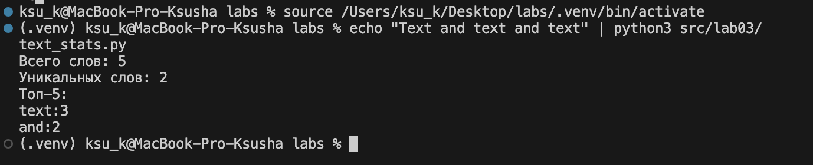

# Лабораторная работа №4
### №1 - io_txt_csv.py
###### read_text - читает текстовый файл и возвращает его содержимое как строку. Чтение в формате UTF-8 по умолчанию. Для работы с файлами в разных кодировках можно указать: "utf-8" (по умолчанию), "cp1251" или "windows-1251" (русская кодировка Windows), "koi8-r" (русская кодировка для UNIX-систем), "iso-8859-5" (другая русская кодировка), "cp866" (русская кодировка DOS). 
###### write_csv - записывает данные в CSV.
###### ensure_parent_dir - создает родительские директории, если они не существуют.

```
import csv
from pathlib import Path
from typing import Iterable, Sequence

def read_text(path: str | Path, encoding: str = "utf-8") -> str:
    """Читает файл и возвращает текст."""
    """
        Пользователь может выбрать другую кодировку, например: encoding="cp1251"
        для чтения файлов созданных в Windows на русском языке.
    """
    p = Path(path)

    if not p.exists():
        raise FileNotFoundError(f"Файл не найден: {path}")
    
    try:
        return p.read_text(encoding=encoding)
    except UnicodeDecodeError:
        raise


def write_csv(rows: Iterable[Sequence], path: str | Path,
              header: tuple[str, ...] | None = None) -> None:
    p = Path(path)
    rows = list(rows)
    """Записывает данные в CSV файл."""
    # Проверка одинаковой длины строк
    if rows:
        first_len = len(rows[0])
        for i, row in enumerate(rows):
            if len(row) != first_len:
                raise ValueError(f"Строка {i} имеет длину {len(row)}, ожидается {first_len}")

    ensure_parent_dir(path)

    with p.open("w", newline="", encoding="utf-8") as f:
        w = csv.writer(f)
        if header is not None:
            w.writerow(header)
        for r in rows:
            w.writerow(r)

def ensure_parent_dir(path: str | Path) -> None:
    """Создает родительские директории, если их нет."""
    Path(path).parent.mkdir(parents=True, exist_ok=True)

if __name__ == "__main__":
    txt = read_text("data/input.txt")  # должен вернуть строку
    print("Прочитано:", txt)
    write_csv([("word","count"),("test",3)], "data/check.csv") 
    print("CSV создан")


```
###### Вывод первого задания
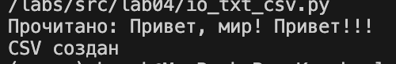


### №2 - text_report.py
###### Скрипт анализирует текстовый файл, подсчитывает частоты слов и генерирует CSV отчет.

```
import sys
from collections import Counter

try:
    from lab04.io_txt_csv import read_text, write_csv, ensure_parent_dir
except ImportError:
    #Альтернативный импорт для тестирования
    import os
    sys.path.append(os.path.dirname(os.path.dirname(__file__)))
    from lab04.io_txt_csv import read_text, write_csv, ensure_parent_dir
from lib.text import normalize, tokenize, count_freq, top_n

def frequencies_from_text(text: str) -> dict[str, int]:
    """
    Генерация частот из текста .
    """
    tokens = tokenize(normalize(text))
    return Counter(tokens)

def sorted_word_counts(freq: dict[str, int]) -> list[tuple[str, int]]:
    """
    Сортировка частот по шаблону: (-частота, слово).
    """
    return sorted(freq.items(), key=lambda kv: (-kv[1], kv[0]))

def generate_report():
    """
    Генерирует отчет по частотам слов.
    """
    input_file = "data/input.txt"
    output_file = "data/report.csv"
    
    try:
        # 1 Чтение текста 
        text = read_text(input_file)
        
        # 2 Подсчет частот через шаблонную функцию
        freq = frequencies_from_text(text)
        
        # 3 Сортировка по шаблону
        sorted_words = sorted_word_counts(freq)
        
        # 4 Сохранение отчета
        ensure_parent_dir(output_file)
        write_csv(sorted_words, output_file, header=("word", "count"))
        
        # 5 Вывод статистики в консоль
        tokens = tokenize(normalize(text))
        print(f"Всего слов: {len(tokens)}")
        print(f"Уникальных слов: {len(freq)}")
        print("Топ-5:")
        
        for word, count in top_n(freq, 5):
            print(f"{word}: {count}")
            

    except Exception as e:
        print(f"Ошибка: {e}")
        sys.exit(1)

if __name__ == "__main__":
    generate_report()


```
###### Вывод при input.txt - Привет, мир! Привет!!!
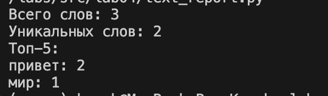
###### report.csv при input.txt - Привет, мир! Привет!!!
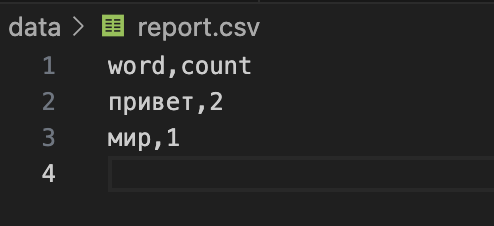
###### report.csv при пустом input.txt 
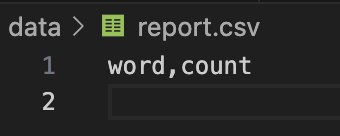
###### Вывод при input.txt в cp1251 с текстом Привет
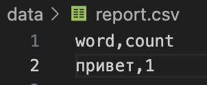


# Лабораторная работа №5
### №1 - json_csv.py
###### Конвертация из json в csv и из csv в json

```

import json
import csv
from pathlib import Path

def json_to_csv(json_path: str, csv_path: str) -> None:
    """Преобразует JSON-файл в CSV."""
    if Path(json_path).suffix != '.json' or Path(csv_path).suffix != '.csv':
        raise TypeError("Неверное расширение файла")
    
    with open(json_path, encoding="utf-8") as f: 
        data = json.load(f)
    
    if not data or not isinstance(data, list) or not all(isinstance(item, dict) for item in data):
        raise ValueError("Пустой JSON или неподдерживаемая структура")
    
    # Собираем все уникальные ключи из всех объектов
    fieldnames = sorted({key for item in data for key in item.keys()})
    
    with open(csv_path, "w", newline="", encoding="utf-8") as cf:
        writer = csv.DictWriter(cf, fieldnames=fieldnames)
        writer.writeheader()
        # Заполняем отсутствующие поля пустыми строками
        for item in data:
            row = {field: item.get(field, '') for field in fieldnames}
            writer.writerow(row)

def csv_to_json(csv_path: str, json_path: str) -> None:
    """Преобразует CSV в JSON (список словарей)."""
    if Path(csv_path).suffix != '.csv' or Path(json_path).suffix != '.json':
        raise TypeError("Неверное расширение файла")
    
    with open(csv_path, 'r', encoding='utf-8', newline='') as cf:
        reader = csv.DictReader(cf)
        lt_rows = list(reader)
        
    if not lt_rows:
        raise ValueError("CSV файл пуст или содержит только заголовок")
    
    with open(json_path, 'w', encoding='utf-8') as jf:
        json.dump(lt_rows, jf, ensure_ascii=False, indent=2)


csv_to_json('data/samples/people.csv', 'data/out/people_from_csv.json')
json_to_csv("data/samples/people.json", "data/out/people_from_json.csv")

```
###### Сконвертированные csv и json
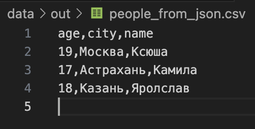
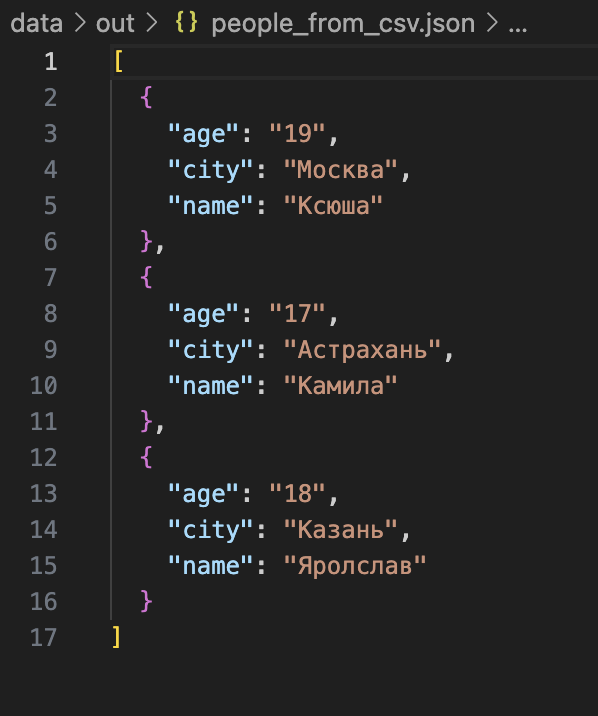

### №2 - csv_xlsx.py
###### Конвертация из csv в xlsx

```
from openpyxl import Workbook
import csv
from pathlib import Path

def csv_to_xlsx(csv_path: str, xlsx_path: str) -> None:
    """Конвертирует CSV в XLSX."""
    if not Path(csv_path).exists():
        raise FileNotFoundError(f"CSV файл не найден: {csv_path}")
    
    wb = Workbook()
    ws = wb.active
    ws.title = "Sheet1"
    
    try:
        with open(csv_path, encoding="utf-8") as f:
            reader = csv.reader(f)
            rows = list(reader)
            
            if not rows:
                raise ValueError("CSV файл пуст")
            
            for row in rows:
                ws.append(row)
            
            # Автоширина колонок
            for column in ws.columns:
                if column:  # Проверяем что колонка не пустая
                    mx = max(len(str(cell.value)) for cell in column)
                    ws.column_dimensions[column[0].column_letter].width = max(mx + 2, 8)
        
        wb.save(xlsx_path)
        
    except csv.Error as e:
        raise ValueError(f"Ошибка чтения CSV: {e}")
    
csv_to_xlsx('data/samples/cities.csv', 'data/out/cities.xlsx')
csv_to_xlsx('data/samples/people.csv', 'data/out/people.xlsx')

```
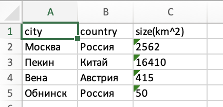
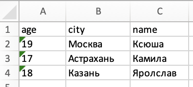


# Лабораторная работа №6
### №1 - cli_text.py
###### Реализация консольных утилит для работы с текстом

```
import argparse
from pathlib import Path

try:
    from lib.text import normalize, tokenize, count_freq, top_n
except ImportError:
    # Альтернативный импорт для тестирования
    import os
    import sys
    sys.path.append(os.path.dirname(os.path.dirname(__file__)))
    from lib.text import normalize, tokenize, count_freq, top_n


def main():
    parser = argparse.ArgumentParser(description="CLI‑утилиты")
    subparsers = parser.add_subparsers(dest="command")

    # подкоманда cat 
    cat_parser = subparsers.add_parser("cat", help="Вывести содержимое файла")
    cat_parser.add_argument("--input", required=True, help="Путь к файлу для вывода")
    cat_parser.add_argument("-n", action="store_true", help="Нумеровать строки")

    # подкоманда stats 
    stats_parser = subparsers.add_parser("stats", help="Частоты слов")
    stats_parser.add_argument("--input", required=True, help="Путь к текстовому файлу")
    stats_parser.add_argument("--top", type=int, default=5, help="Количество топ-слов")

    args = parser.parse_args()

    if not args.command:
        parser.print_help()
        return

    file_path = Path(args.input)
    if not file_path.exists():
        parser.error(f"Файл '{args.input}' не найден")

    if args.command == "cat":
        try:
            with file_path.open("r", encoding="utf-8") as f:
                for i, line in enumerate(f, start=1):
                    line = line.rstrip("\n")
                    if args.n:
                        print(f"{i:6}  {line}")
                    else:
                        print(line)
        except Exception as e:
            parser.error(f"Ошибка при чтении файла: {e}")

    elif args.command == "stats":
        try:
            with file_path.open("r", encoding="utf-8") as f:
                text = f.read()
            
            normalized = normalize(text)
            words = tokenize(normalized)
            freq = count_freq(words)
            top_words = top_n(freq, args.top)

            if not top_words:
                print("Слова не найдены в файле")
                return

            print(f"Топ-{args.top} самых частых слов:")
            print("Слово\t\tЧастота")
            print("-" * 20)
            for word, count in top_words:
                print(f"{word:<15} {count}")

        except Exception as e:
            parser.error(f"Ошибка при анализе текста: {e}")

if __name__ == "__main__":
    main()

```
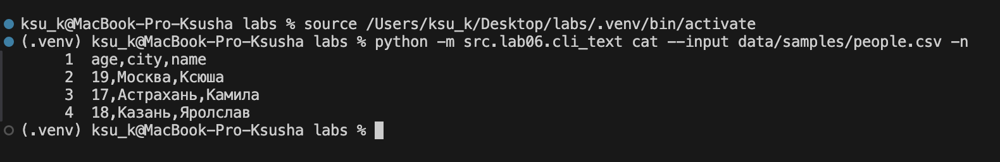
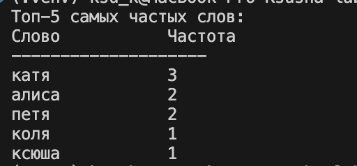


### №2 - cli_convert.py
###### Реализация консольных утилит для конвертации данных между форматами

```
import argparse
from pathlib import Path
try:
    from lab05.json_csv import *
except ImportError:
    # Альтернативный импорт для тестирования
    import os
    import sys
    sys.path.append(os.path.dirname(os.path.dirname(__file__)))
    from lab05.json_csv import *
try:
    from lab05.csv_xlsx import *
except ImportError:
    # Альтернативный импорт для тестирования
    import os
    import sys
    sys.path.append(os.path.dirname(os.path.dirname(__file__)))
    from lab05.csv_xlsx import *

def main():
    parser = argparse.ArgumentParser(description="Конвертер JSON в CSV, CSV в JSON, CSV в XLSX")
    sub = parser.add_subparsers(dest="cmd")

    # json → csv
    json2csv_parser = sub.add_parser("json2csv", help="Конвертировать JSON в CSV")
    json2csv_parser.add_argument("--in", dest="input", required=True, help="Путь к входному JSON")
    json2csv_parser.add_argument("--out", dest="output", required=True, help="Путь к выходному CSV")

    # csv → json
    csv2json_parser = sub.add_parser("csv2json", help="Конвертировать CSV в JSON")
    csv2json_parser.add_argument("--in", dest="input", required=True, help="Путь к входному CSV")
    csv2json_parser.add_argument("--out", dest="output", required=True, help="Путь к выходному JSON")

    # csv → xlsx
    csv2xlsx_parser = sub.add_parser("csv2xlsx", help="Конвертировать CSV в XLSX")
    csv2xlsx_parser.add_argument("--in", dest="input", required=True, help="Путь к входному CSV")
    csv2xlsx_parser.add_argument("--out", dest="output", required=True, help="Путь к выходному XLSX")

    args = parser.parse_args()

    if not args.cmd:
        parser.print_help()
        return

    input_path = Path(args.input)
    if not input_path.exists():
        parser.error(f"Входной файл '{args.input}' не найден")

    # Создаем выходную директорию если не существует
    output_path = Path(args.output)
    output_path.parent.mkdir(parents=True, exist_ok=True)

    try:
        if args.cmd == "json2csv":
            json_to_csv(args.input, args.output)
            print(f"Успешно конвертировано: {args.input} -> {args.output}")
            
        elif args.cmd == "csv2json":
            csv_to_json(args.input, args.output)
            print(f"Успешно конвертировано: {args.input} -> {args.output}")
            
        elif args.cmd == "csv2xlsx":
            csv_to_xlsx(args.input, args.output)
            print(f"Успешно конвертировано: {args.input} -> {args.output}")
            
    except Exception as e:
        parser.error(f"Ошибка конвертации: {e}")


if __name__ == "__main__":
    main()

```

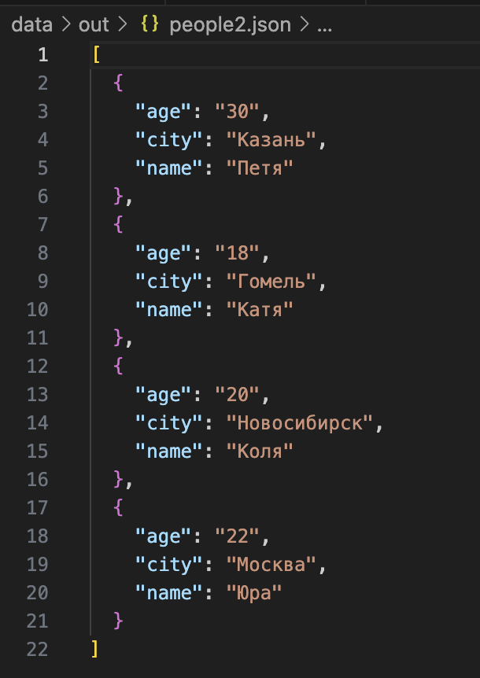
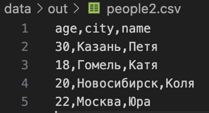
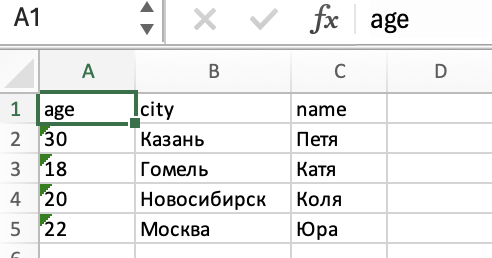
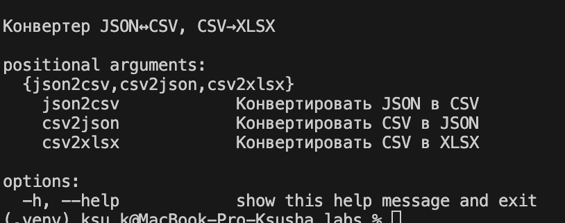


# Лабораторная работа №7
### №1 - тесты для src/lib/text.py (text_test.py)

```

import pytest

try:
    from src.lib.text import normalize, tokenize, count_freq, top_n
except ImportError:
    # Альтернативный импорт для тестирования
    import os
    import sys

    sys.path.append(os.path.dirname(os.path.dirname(__file__)))
    from src.lib.text import normalize, tokenize, count_freq, top_n


@pytest.mark.parametrize(
    "source, expected",
    [
        ("ПрИвЕт\nМИр\t", "привет мир"),
        ("ёжик, Ёлка", "ежик, елка"),
        ("Hello\r\nWorld", "hello world"),
        ("  двойные   пробелы  ", "двойные пробелы"),
        ("", ""),
        ("   ", ""),
        (3, TypeError)
    ],
)
def test_normalize(source, expected):
    if type(source) != str:
        with pytest.raises(expected):
            normalize(source) 
    else:
        assert normalize(source) == expected

    


@pytest.mark.parametrize(
    "text, expected",
    [
        ("привет мир", ["привет", "мир"]),
        ("hello world test", ["hello", "world", "test"]),
        ("", []),
        ("   ", []),
        ("знаки, препинания! тест.", ["знаки", "препинания", "тест"]),
    ],
)
def test_tokenize(text, expected):
    assert tokenize(text) == expected


def test_count_freq_basic():
    tokens = ["apple", "banana", "apple", "cherry", "banana", "apple"]
    result = count_freq(tokens)
    expected = {"apple": 3, "banana": 2, "cherry": 1}
    assert result == expected


def test_count_freq_empty():
    assert count_freq([]) == {}


def test_top_n_basic():
    freq = {"apple": 5, "banana": 3, "cherry": 7, "date": 1}
    result = top_n(freq, 2)
    expected = [("cherry", 7), ("apple", 5)]
    assert result == expected


def test_top_n_tie_breaker():
    freq = {"banana": 3, "apple": 3, "cherry": 3}
    result = top_n(freq, 3)
    expected = [("apple", 3), ("banana", 3), ("cherry", 3)]
    assert result == expected


def test_top_n_empty():
    assert top_n({}, 5) == []


def test_full_pipeline():
    text = "Привет мир! Привет всем. Мир прекрасен."
    normalized = normalize(text)
    tokens = tokenize(normalized)
    freq = count_freq(tokens)
    top_words = top_n(freq, 2)

    assert normalized == "привет мир! привет всем. мир прекрасен."
    assert tokens == [
        "привет",
        "мир",
        "привет",
        "всем",
        "мир",
        "прекрасен",
    ]
    assert freq == {"привет": 2, "мир": 2, "всем": 1, "прекрасен": 1}
    assert top_words == [("мир", 2), ("привет", 2)]


```


### №2 - тесты для src/lab05/json_csv.py (test_json_csv.py)

```

import pytest
import json
import csv

try:
    from lab05.json_csv import json_to_csv, csv_to_json
except ImportError:
    # Альтернативный импорт для тестирования
    import os
    import sys

    sys.path.append(os.path.dirname(os.path.dirname(__file__)))
    from src.lab05.json_csv import json_to_csv, csv_to_json


# Базовые тесты для успешных сценариев
@pytest.mark.parametrize(
    "test_name,data,expected_count",
    [
        ("basic", [{"name": "Alice", "age": 25}, {"name": "Bob", "age": 30}], 2),
        (
            "complex_data",
            [{"name": "Alice", "age": 25, "active": True, "score": 95.5}],
            1,
        ),
        (
            "different_order",
            [{"name": "Alice", "age": 25}, {"age": 30, "name": "Bob"}],
            2,
        ),
        ("empty_values", [{"name": "Alice", "age": 25, "comment": ""}], 1),
        ("unicode", [{"name": "Алиса", "message": "Привет! 🌍"}], 1),
    ],
)
def test_json_to_csv_success(tmp_path, test_name, data, expected_count):
    """Параметризованный тест успешных преобразований JSON в CSV"""
    src = tmp_path / f"{test_name}.json"
    dst = tmp_path / f"{test_name}.csv"

    src.write_text(json.dumps(data, ensure_ascii=False), encoding="utf-8")
    json_to_csv(str(src), str(dst))

    assert dst.exists()  # проверка_создания_файла
    with dst.open(encoding="utf-8") as f:
        rows = list(csv.DictReader(f))

    assert len(rows) == expected_count
    assert rows[0]["name"] == data[0]["name"]


@pytest.mark.parametrize(
    "test_name,csv_content,expected_count",
    [
        ("basic", "name,age\nAlice,25\nBob,30", 2),
        (
            "special_chars",
            'name,description\n"Alice","Test, comma"',
            1,
        ),  # специальные_символы #кавычки
        ("semicolon_delim", "name;age\nAlice;25\nBob;30", 2),
    ],
)
def test_csv_to_json_success(tmp_path, test_name, csv_content, expected_count):
    """Параметризованный тест успешных преобразований CSV в JSON"""
    src = tmp_path / f"{test_name}.csv"  # входные_данные
    dst = tmp_path / f"{test_name}.json"  # выходные_данные

    src.write_text(csv_content, encoding="utf-8")
    csv_to_json(str(src), str(dst))

    assert dst.exists()
    with dst.open(encoding="utf-8") as f:
        data = json.load(f)  # загрузка_json

    assert len(data) == expected_count


# Тесты для ошибок JSON
@pytest.mark.parametrize(
    "test_name,file_content,expected_error",
    [
        ("file_not_found", None, FileNotFoundError),
        ("invalid_json", "{ invalid json }", ValueError),
        ("empty_file", "", ValueError),
        ("not_list", '{"name": "test"}', ValueError),
        ("empty_list", "[]", ValueError),
        ("mixed_list", '[{"name": "test"}, "not_dict"]', ValueError),
        ("invalid_encoding", b"\xff\xfe\x00\x00", ValueError),
    ],
)
def test_json_to_csv_errors(tmp_path, test_name, file_content, expected_error):
    """Параметризованный тест ошибок JSON в CSV"""
    src = tmp_path / f"{test_name}.json"
    dst = tmp_path / "output.csv"

    if file_content is None:
        # Тест для несуществующего файла
        with pytest.raises(expected_error):
            json_to_csv("nonexistent.json", str(dst))
    else:
        # Тест для файла с ошибкой в содержимом
        if isinstance(file_content, bytes):
            src.write_bytes(file_content)
        else:
            src.write_text(file_content, encoding="utf-8")

        with pytest.raises(expected_error):  # проверка_исключения
            json_to_csv(str(src), str(dst))


# Тесты для ошибок CSV
@pytest.mark.parametrize(
    "test_name,file_content,expected_error",
    [
        ("file_not_found", None, FileNotFoundError),
        ("empty_file", "", ValueError),
        ("empty_header", "\nAlice,25", ValueError),
        ("empty_columns", "name,,age\nAlice,25,30", ValueError),
        ("invalid_encoding", b"\xff\xfe\x00\x00", ValueError),
    ],
)
def test_csv_to_json_errors(tmp_path, test_name, file_content, expected_error):
    """Параметризованный тест ошибок CSV в JSON"""
    src = tmp_path / f"{test_name}.csv"
    dst = tmp_path / "output.json"

    if file_content is None:
        # Тест для несуществующего файла
        with pytest.raises(expected_error):
            csv_to_json("nonexistent.csv", str(dst))
    else:
        # Тест для файла с ошибкой в содержимом
        if isinstance(file_content, bytes):
            src.write_bytes(file_content)
        else:
            src.write_text(file_content, encoding="utf-8")

        with pytest.raises(expected_error):
            csv_to_json(str(src), str(dst))


# Спец. тесты
def test_json_csv_roundtrip(tmp_path):
    """Тест полного цикла преобразования"""
    original_json = tmp_path / "original.json"
    intermediate_csv = tmp_path / "intermediate.csv"
    final_json = tmp_path / "final.json"

    original_data = [{"name": "Alice", "age": 25}, {"name": "Bob", "age": 30}]
    original_json.write_text(json.dumps(original_data), encoding="utf-8")

    json_to_csv(str(original_json), str(intermediate_csv))
    csv_to_json(str(intermediate_csv), str(final_json))

    with final_json.open(encoding="utf-8") as f:
        final_data = json.load(f)  # чтение_результата

    assert len(final_data) == 2  # #проверка_сохранения_данных
    assert final_data[0]["name"] == "Alice"  # проверка_целостности


def test_unexpected_errors(monkeypatch, tmp_path):
    """Тест неожиданных ошибок"""
    # Тест для JSON
    src_json = tmp_path / "test.json"
    dst_json = tmp_path / "test.csv"
    src_json.write_text('[{"name": "test"}]', encoding="utf-8")

    def mock_getsize(path):
        raise RuntimeError("Unexpected error")

    monkeypatch.setattr("os.path.getsize", mock_getsize)  # подмена_функции

    with pytest.raises(ValueError, match="Неожиданная ошибка"):
        json_to_csv(str(src_json), str(dst_json))

    # Тест для CSV
    src_csv = tmp_path / "test.csv"
    dst_csv = tmp_path / "test.json"
    src_csv.write_text("name,age\nAlice,25", encoding="utf-8")
    original_open = open

    def mock_open(*args, **kwargs):
        if args[0].endswith(".csv") and "r" in args[1]:
            raise RuntimeError("Unexpected read error")
        return original_open(*args, **kwargs)

    monkeypatch.setattr("builtins.open", mock_open)

    with pytest.raises(ValueError, match="Неожиданная ошибка"):
        csv_to_json(str(src_csv), str(dst_csv))


def test_csv_empty_data_with_header(tmp_path):
    """Тест для CSV только с заголовком"""
    src = tmp_path / "only_header.csv"
    dst = tmp_path / "test.json"

    src.write_text("name,age", encoding="utf-8")  # преобразование_пустого_csv

    csv_to_json(str(src), str(dst))

    assert dst.exists()
    with dst.open(encoding="utf-8") as f:
        data = json.load(f)

    assert len(data) == 0  # Пустой список, так как нет данных


def test_json_to_csv_wrong_extension(tmp_path):
    # Тест: JSON файл с неправильным расширением
    src = tmp_path / "test.txt"  # Не .json файл
    dst = tmp_path / "test.csv"

    src.write_text('[{"name": "test"}]', encoding="utf-8")  # json_в_txt_файле

    with pytest.raises(ValueError, match="не является JSON файлом"):
        json_to_csv(str(src), str(dst))


def test_csv_to_json_wrong_extension(tmp_path):
    # Тест: CSV файл с неправильным расширением
    src = tmp_path / "test.txt"  # Не .csv файл
    dst = tmp_path / "test.json"

    src.write_text("name,age\nAlice,25", encoding="utf-8")

    with pytest.raises(ValueError, match="не является CSV файлом"):
        csv_to_json(str(src), str(dst))


```
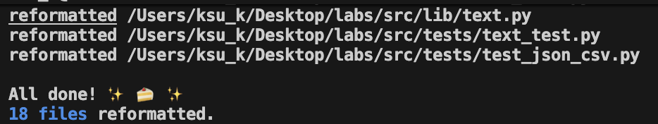
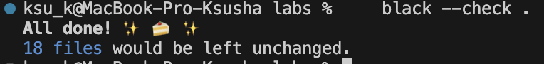
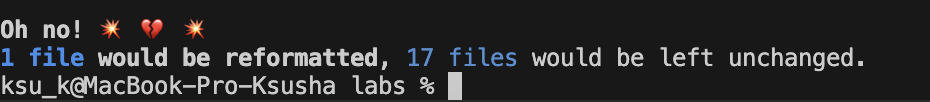


# Лабораторная работа №8
### №1 - models.py (реализация класса Student)

```
from dataclasses import dataclass
from datetime import datetime, date
from typing import Dict, Any

@dataclass
class Student:
    fio: str
    birthdate: str
    group: str
    gpa: float

    def __post_init__(self):
        # Валидация даты
        try:
            datetime.strptime(self.birthdate, "%Y-%m-%d")
        except ValueError:
            raise ValueError(f"Неверный формат даты: {self.birthdate}. Используйте YYYY-MM-DD")
        
        # Валидация GPA
        if not (0 <= self.gpa <= 5):
            raise ValueError(f"GPA должен быть от 0 до 5, получено: {self.gpa}")
        
        # Валидация ФИО 
        if len(self.fio.strip().split()) < 2:
            raise ValueError(f"ФИО должно содержать минимум 2 слова: {self.fio}")

    def age(self) -> int:
        birth_date = datetime.strptime(self.birthdate, "%Y-%m-%d").date()
        today = date.today()
        age = today.year - birth_date.year
        
        if (today.month, today.day) < (birth_date.month, birth_date.day):
            age -= 1
            
        return age

    def to_dict(self) -> Dict[str, Any]:
        return {
            "fio": self.fio,
            "birthdate": self.birthdate,
            "group": self.group,
            "gpa": self.gpa
        }

    @classmethod
    def from_dict(cls, data: Dict[str, Any]) -> 'Student':
        # Проверка обязательных полей
        required = ['fio', 'birthdate', 'group', 'gpa']
        for field in required:
            if field not in data:
                raise KeyError(f"Отсутствует поле: {field}")
        
        return cls(
            fio=str(data["fio"]),
            birthdate=str(data["birthdate"]),
            group=str(data["group"]),
            gpa=float(data["gpa"])
        )

    def __str__(self) -> str:
        return f"{self.fio}, {self.group}, GPA: {self.gpa:.2f}, Возраст: {self.age()}"
    

if __name__ == "__main__":
    try:
        student = Student(
            fio="Сидорова Анна Петровна", # Аргумент: ФИО
            birthdate="2005-06-28",
            group="SE-01",
            gpa=4.6
        )
        print(student)
        print(f"Словарь: {student.to_dict()}")
    except ValueError as e:
        print(f"Ошибка: {e}")

```

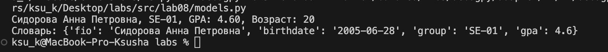


### №2 - serialize.py

```
import json
from typing import List
from models import Student

def students_to_json(students: List[Student], path: str) -> None:
    """Сериализация с базовой проверкой"""
    if not students:
        print("Внимание: пустой список студентов")
        return
    
    data = [student.to_dict() for student in students]
    
    try:
        with open(path, 'w', encoding='utf-8') as f:
            json.dump(data, f, ensure_ascii=False, indent=2)
        print(f"Сохранено {len(students)} студентов в {path}")
    except Exception as e:
        print(f"Ошибка при сохранении: {e}")

def students_from_json(path: str) -> List[Student]:
    """Десериализация с обработкой ошибок"""
    try:
        with open(path, 'r', encoding='utf-8') as f:
            data = json.load(f)
    except FileNotFoundError:
        print(f"Файл не найден: {path}")
        return []
    except json.JSONDecodeError:
        print(f"Ошибка формата JSON в файле: {path}")
        return []
    
    if not isinstance(data, list):
        print(f"Ожидался список, получен {type(data).__name__}")
        return []
    
    students = []
    errors = []
    
    for i, item in enumerate(data):
        try:
            student = Student.from_dict(item)
            students.append(student)
        except (ValueError, KeyError, TypeError) as e:
            errors.append(f"Строка {i}: {e}")
    
    if errors:
        print("Найдены ошибки при загрузке:")
        for error in errors:
            print(f"  - {error}")
    
    return students

if __name__ == "__main__": # Проверка запущен ли скрипт напрямую
    # Пример использования
    students = [
        Student("Комаров Сергей", "2006-11-25", "SE-01", 4.6),
        Student("Каплан Алексей", "2007-10-14", "SE-02", 4.4),
        Student("Попова Александра", "2002-05-16", "SE-03", 3.8)
    ]
    
    # Сериализация
    students_to_json(students, "data/lab08/students_output.json")
    
    # Десериализация
    loaded_students = students_from_json("data/lab08/students_input.json")
    for student in loaded_students:
        print(student)

```

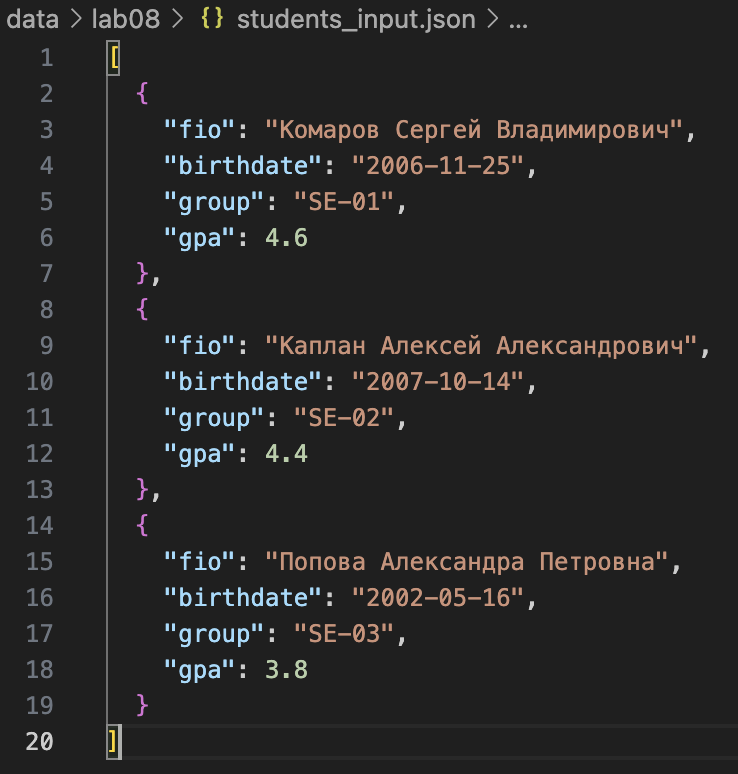
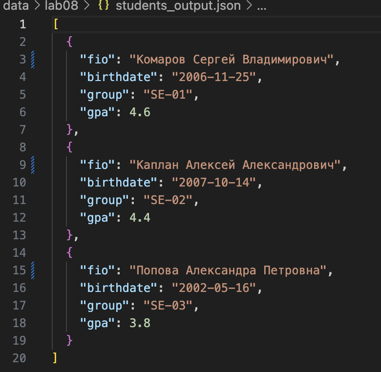
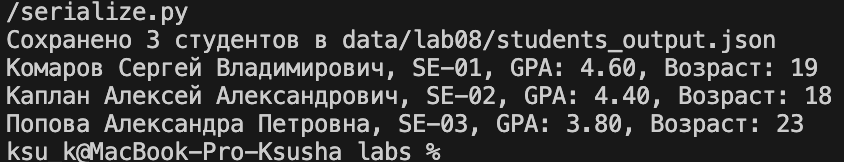


