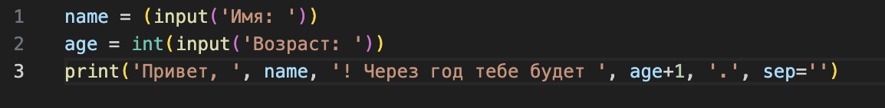
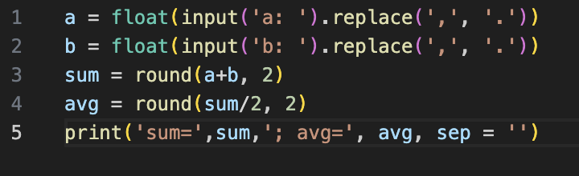
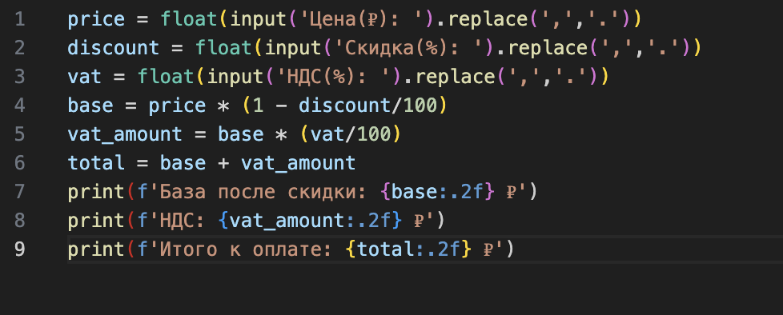
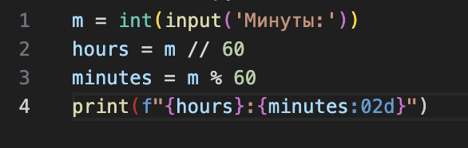
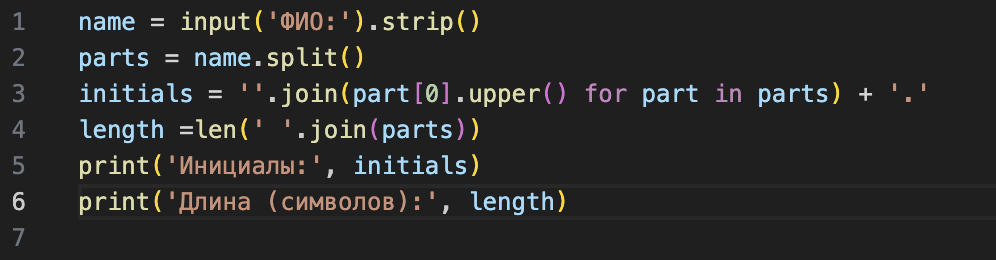

# Лабораторная работа №1

### Вывод прграммы: имя и возраст через год

### Вывод прграммы: сумма и среднее число

### Вывод прграммы: база после скидки, НДС, итог к оплате

### Вывод прграммы: время

### Вывод прграммы: инициалы и цена

